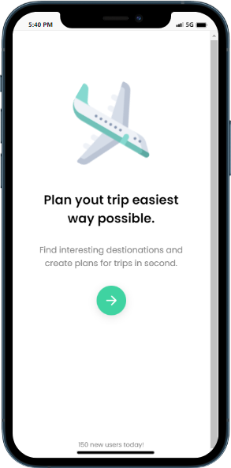
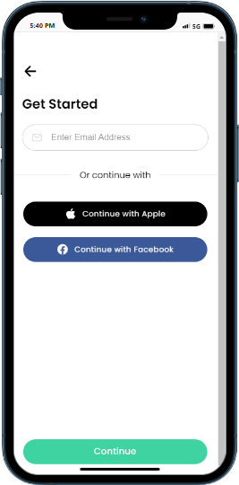
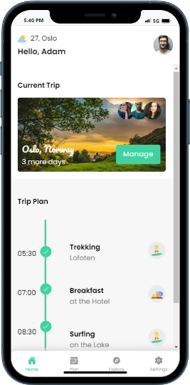
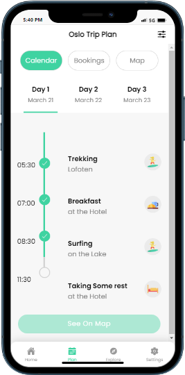
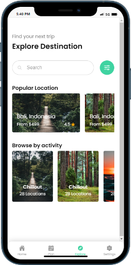
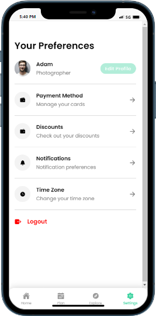

# Trip Planner and Trip Booking App
 This app for the travel lovers. Using this app user can manage the book the trip to any where in the world or can post the plan to invite the others to come and be the part of their joureny.
 

  


##  Features
- User can Book the trip 
- can see the trip days mangement through this app 
- user can also plan the trip 
- user can invite other to join the trip 
- user can also book the flight 
- user can book any kind of cab for their trip 
- user can set the calender to plan 
- other users can also see the plan and destination and also other upload the pics of destination 


## Operating System 
this Software support All operating System 
- Android
- IOS
- Desktop
- Web
##  Screenshots


 
  
   
    
     
      
       

## Technologies & Lnaguages 

**Client:** Ionic 6.0 , Capacitor 3.0 & above , Angular , Java Script 

**Server:** REST API's (SlimFramework), PHP 


## Acknowledgements

 - [Learn@Earn Professional Institute Of Computer Science](https://learn2earnn.com)
 - [Learn2Earn Blog](https://ioniccapacitor.com)
 


## Demo

[Medical Appointemtn Booking app](https://learn2earn-travel.netlify.app/).


## Authors

- [Learn2Earn Software Solutions](https://github.com/orgs/Learn2Earn-Team)


## Installation

To Install the Project in Directory. Clone With Following link 

```bash
  https://github.com/Learn2Earn-Team/Property-Management-System.git
```
    
## Build For Android

To generate the APK for the Android runn this command 


```bash
  npm run android
```

this command will open Android Studion Software 
and there you will simply build the APK.


## FAQ

#### Can We test the App ?

yes you can install by using upper instruction 

#### What is user name and password ?

Yes you can login by using below credentials
username : admin
password : 2233
role : admin

#### Can We buy Monthly Subscriptions?
yes you can buy the software on Monthly Subscriptions.
for plan you can visit us.
- [Learn2Earn Software Solutions](https://github.com/orgs/Learn2Earn-Team)

#### Can we buy through Onetime Payment?

yes you can also buy through one time payment.
## 🚀 About Us
We are Complete Software house , Running Since 2018 with the team of more then 20 peoples.
we are wroking on different platforms and try to give all services to the clinet 


## Services 
We provide multiple Services
- Android app 
- Ios app 
- Web Development 
- Graphics Designind 
- Animated Videos 
- Digital Marketing 
## 🔗 Links
[](https://learn2earnn.com/L2E_Portfolio.html)
[](https://www.linkedin.com/in/learn2earn-software-solutions-2b62b9262/)
[](https://web.facebook.com/Learn2Earn.Institute)


## Support

For support, email support@learn2earnn.com or Contact us on  [Fiverr](https://www.fiverr.com/learn2earnpk).

